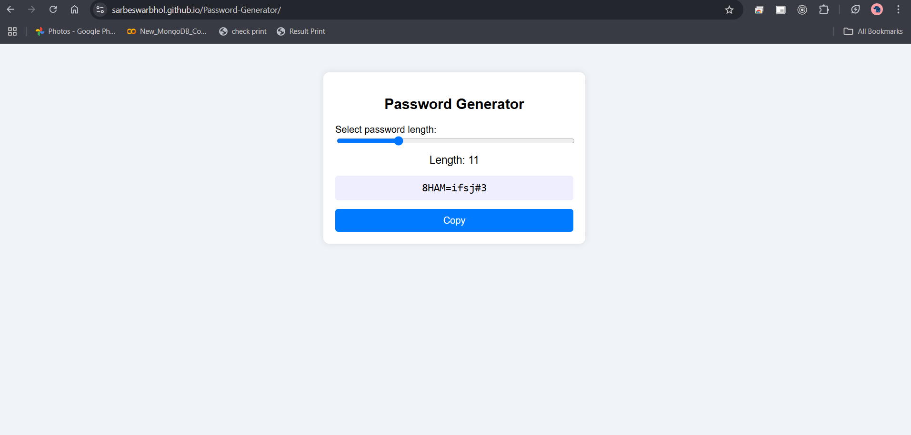

# Password Generator

A sleek, modern, and responsive web-based password generator that lets you generate strong random passwords with customizable lengths. Built using HTML, CSS, and vanilla JavaScript.

---

## 📌 Features

- 🔢 Adjustable password length (4–32 characters)
- 🎲 Randomized password with letters, numbers & symbols
- 📋 Copy-to-clipboard button
- 🖥️ Responsive and clean user interface
- ⚡ Instant password regeneration as you slide

---

## 🚀 Demo

🟢 **Live Demo:** [Click here to try it out](https://sarbeswarbhol.github.io/Password-Generator/)  

---

## 🎥 Preview

### 🖼️ Screenshot

---

## 🛠️ How It Works

1. Adjust the slider to select the password length.
2. A strong password is generated instantly.
3. Click "Copy" to save the password to your clipboard.

---

---

## 🧰 Technologies Used

- HTML5
- CSS3
- JavaScript (ES6)

---
